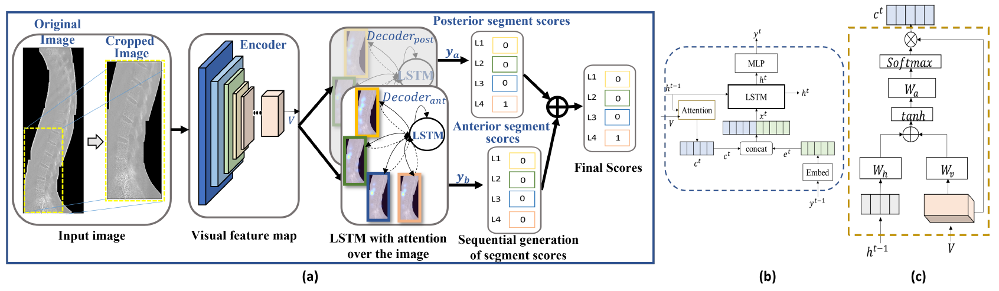
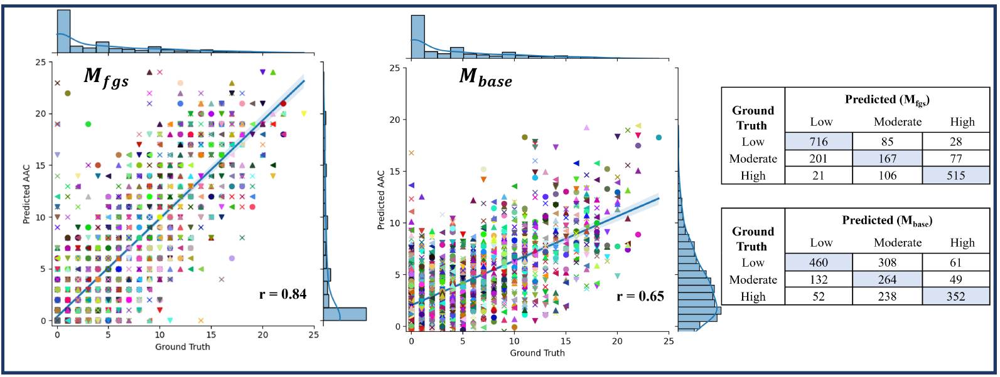
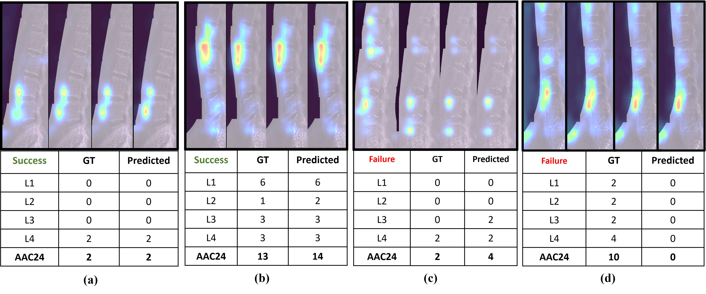

# Show-Attend-and-Detect
More than 55,000 people world-wide die from Cardiovascular Disease (CVD) each day. Calcification of the abdominal aorta is an established marker of asymptomatic CVD. It can be observed on scans taken for vertebral fracture assessment from Dual Energy X-ray Absorptiometry machines. Assessment of Abdominal Aortic Calcification (AAC) and timely intervention may help to reinforce public health messages around CVD risk factors and improve disease management, reducing the global health burden related to CVDs. Our research addresses this problem by proposing a novel and reliable framework for automated “fine-grained” assessment of AAC. Inspired by the vision-to-language models, our method performs sequential scoring of calcified lesions along the length of the abdominal aorta on DXA scans; mimicking the human scoring process.

## Network Architecture

 
Our proposed (a) framework for automatic fine-grained AAC scoring,(b) detailed schematic of our attention-based decoders, and (c) attention module.

## Dependencies

## Training Script

## Evaluation

 
Scatter plots and confusion matrix of fine-grained ground truth scores vs predicted scores for our proposed model Mfgs and ground truth vs our implementation of the baseline Mbase [15] overall AAC-24 score per scan.

## Qualitative Results

 
Figure 4

Our qualitative results show the attention maps generated by our decoding pipeline.
Figure 4 shows some examples where our model succeeds (a-b) or fails (cd). The four sub-figures in each section are from four different time stamps of our sequential attention model. The model “sees” a particular vertebrae at a given time stamp, “attends” to it and “detects” the amount of calcification. It then moves on to the next vertebrae in the sequence. Figure 4(a-b) show how the model attends to each vertebrae and correctly scores the calcification.
Figure 4(c) shows failure cases where the model over-estimates the score of L3 while (d) portrays a case where it totally fails to identify the heavy calcification. However, Figure 4(d) is very interesting as the aorta in the DXA scan produced by the GE iDXA machine is masked for radiation dose reduction. The human experts have not scored L2 and L3 anterior sections of this scan because they are not visible. Our model is unable to “see” the aorta and hence outputs a zero score. (This is good because a higher predicted score would have meant that the model is not paying attention to the aorta in the score generation process).
